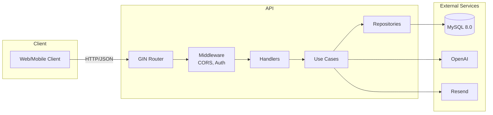
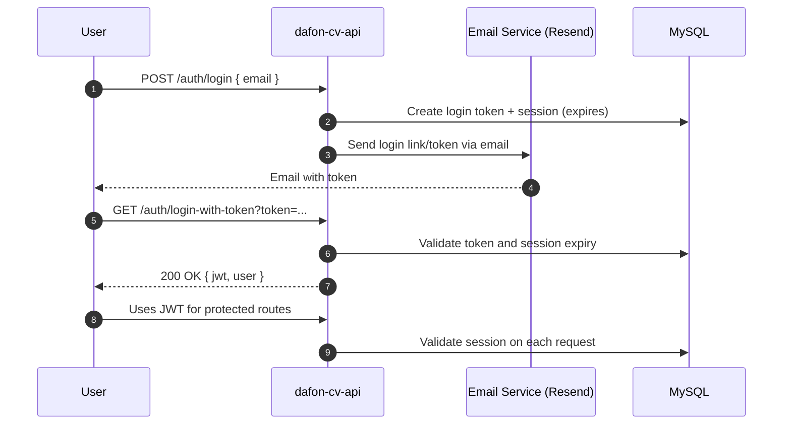
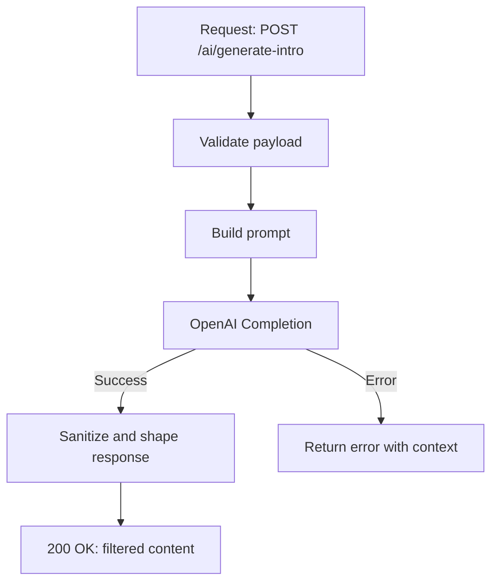
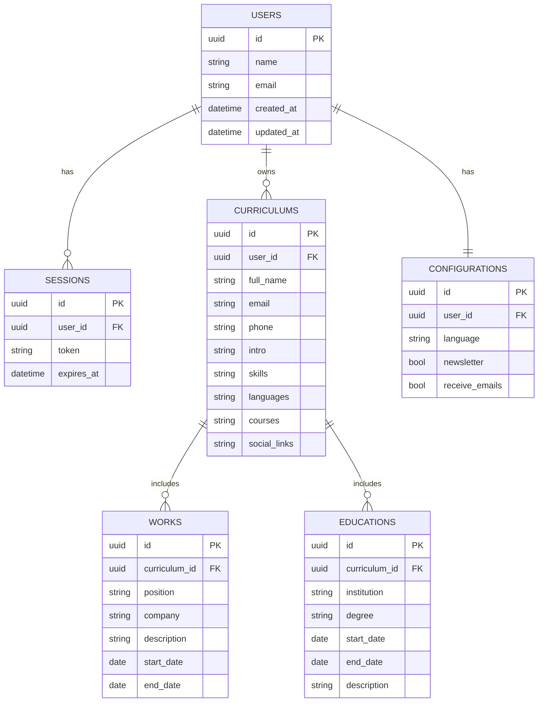
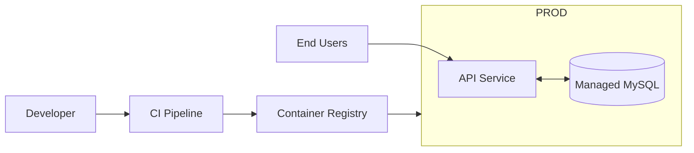

# 📄 dafon-cv-api

[](https://golang.org/)
[](LICENSE)
[](docker-compose.yml)

A robust REST API for CV management with AI features for automatic professional content generation.

## 🧭 Table of Contents

1. Purpose and Value Proposition
2. Architecture Overview
3. Detailed Flows and Diagrams
4. Data Model (ERD)
5. API Documentation
6. Configuration and Environment
7. Security and Hardening
8. Observability (Logging, Health, Metrics)
9. DevOps and Deployment (Docker, Compose, CI/CD)
10. Performance and Scalability
11. Troubleshooting and Runbooks
12. Contributing, License, Author

---

## 🎯 Purpose and Value Proposition

**dafon-cv-api** is a complete solution for creating and managing professional CVs, offering:

- ✅ Secure email-based authentication system (passwordless)
- ✅ Complete CV CRUD operations
- ✅ Automatic content generation with AI (OpenAI)
- ✅ Robust data validation (emails, phones, strong passwords)
- ✅ Clean and scalable architecture with clear boundaries
- ✅ Production-grade containerization and health checks

Target users: professionals, recruiters, freelancers and students who need high-quality resumes, with AI assistance and structured data management.

---

## 🏗️ Architecture Overview

The project follows **Clean Architecture** principles with clear separation of concerns:

```
├── cmd/api/           # Application entry point
├── internal/
│   ├── config/        # Application configuration
│   ├── database/      # Database configuration (GORM, migrations)
│   ├── dto/           # Data Transfer Objects (request/response)
│   ├── errors/        # Custom error types and wrappers
│   ├── handlers/      # Presentation layer (HTTP handlers)
│   ├── middleware/    # Middlewares (Auth, CORS, etc.)
│   ├── models/        # Domain entities (GORM models)
│   ├── repositories/  # Data access (interfaces + impl)
│   ├── routes/        # Route definitions
│   ├── usecases/      # Business logic
│   └── utils/         # Utilities and validations
```

### High-level Architecture Diagram



---

## 🔁 Detailed Flows and Diagrams

### Authentication (Passwordless + JWT) - Sequence Diagram



### AI Content Generation - Flow



---

## 🗂️ Data Model (ERD)



---

## 📚 API Documentation

### Authentication

```http
POST /auth/register          # Register user
POST /auth/login             # Login (sends token via email)
GET  /auth/login-with-token  # Login with token
POST /auth/logout            # Logout
```

### Users

```http
GET    /users/profile        # Get user profile
PUT    /users/profile        # Update profile
DELETE /users/account        # Delete account
```

### Curriculums

```http
GET    /curriculums          # List CVs
POST   /curriculums          # Create CV
GET    /curriculums/:id      # Get CV
PUT    /curriculums/:id      # Update CV
DELETE /curriculums/:id      # Delete CV
```

### AI - Content Generation

```http
POST /ai/generate-intro      # Generate professional introduction
POST /ai/generate-courses    # Generate course list
POST /ai/generate-tasks      # Generate task descriptions
```

### Configurations

```http
GET /configurations          # Get configurations
PUT /configurations          # Update configurations
```

### Health

```http
GET /health                  # Application status
```

> Tip: Use the `Authorization: Bearer <JWT>` header for protected resources.

---

## ⚙️ Configuration and Environment

Create a `.env` file in the project root:

Required:
- `OPENAI_API_KEY`
- `RESEND_API_KEY`
- `DB_PASSWORD`
- `MYSQL_ROOT_PASSWORD`

Optional:
- `PORT` (default: 8080)
- `GIN_MODE` (default: release)
- `DB_HOST` (default: localhost)
- `DB_PORT` (default: 3306)
- `DB_NAME` (default: dafon_cv)
- `APP_URL` (used for CORS)
- `BACKEND_APIKEY` (for static token middleware, if enabled)

> Never commit `.env` files. They are ignored via `.gitignore`.

---

## 🔒 Security and Hardening

- Use HTTPS in production (terminate TLS at reverse proxy)
- Configure CORS origins via `APP_URL`
- Enable rate limiting (e.g., at API gateway or reverse proxy)
- Rotate secrets and API keys regularly
- Avoid static tokens in production; prefer JWT with short TTL
- Sanitize inputs and validate payloads (already implemented via validators)
- Run containers as non-root (distroless base already configured)

---

## 📈 Observability (Logging, Health, Metrics)

- Structured logging via Zap
- Health endpoint: `GET /health`
- Container health checks configured for API and MySQL
- Add metrics (suggestion): Prometheus + Grafana (future enhancement)

---

## 🐳 DevOps and Deployment

### Dockerfile (Multi-stage + Distroless)

- Build with Go Alpine, output static binary
- Final image: Distroless nonroot for minimal attack surface

### docker-compose

- MySQL 8.0 + persistent volume
- API service depends on DB health, exposes `8080`
- Health checks configured para ambos serviços

Run:

```bash
docker compose up -d --build
docker compose logs -f api
```

### CI/CD (Suggestion)

- Lint + test on PRs
- Build image, scan vulnerabilities (Trivy/Grype)
- Push to registry, deploy (Railway/Render/Fly.io)

### Deployment Diagram



---

## 🚀 Performance and Scalability

- Prefer connection pooling tuning (GORM + MySQL)
- Cache hot reads (e.g., Redis) for AI responses or frequent lists
- Apply pagination in list endpoints
- Consider async processing for heavy AI requests

---

## 🧯 Troubleshooting and Runbooks

Common checks:
- `GET /health` returns 200
- `docker compose logs -f api` and `-f mysql`
- Validate env vars loaded in `internal/config`
- Database reachable from API (`DB_HOST`, `DB_PORT`)

Frequent issues:
- 401 on protected routes: missing/invalid JWT
- 400 validation: check DTO constraints (min/max/email/uuid/phone)
- OpenAI errors: ensure `OPENAI_API_KEY`, verify quota/availability

---

## 🛠️ Installation and Local Setup

Prerequisites: Go 1.24.1+, Docker, Docker Compose, OpenAI key, Resend key

Clone:

```bash
git clone https://github.com/Daniel-Fonseca-da-Silva/dafon-cv-api.git
cd dafon-cv-api
```

Run with Docker:

```bash
docker compose up -d --build
```

Run locally (dev):

```bash
go mod download
go run cmd/api/main.go
```

---

## 🤝 Contributing

1. Fork the project
2. Create a feature branch (`git checkout -b feature/AmazingFeature`)
3. Commit your changes (`git commit -m 'Add some AmazingFeature'`)
4. Push to the branch (`git push origin feature/AmazingFeature`)
5. Open a Pull Request

## 📝 License

This project is licensed under the MIT License - see the [LICENSE](LICENSE) file for details.

## 👨‍💻 Author

**Daniel Fonseca da Silva**
- GitHub: [@Daniel-Fonseca-da-Silva](https://github.com/Daniel-Fonseca-da-Silva)

---

⭐ If this project was helpful to you, consider giving it a star!